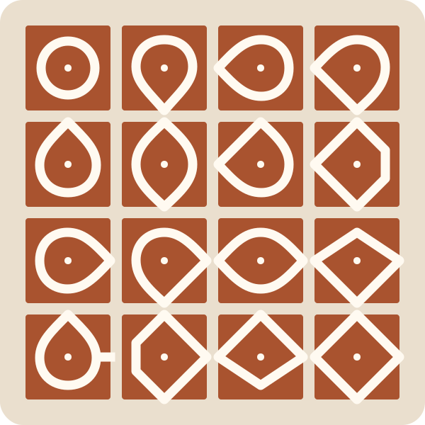

::: {.mn-hero}
::: {.mn-hero-copy}

COURSES · WRITING · VIDEOS · PROJECTS

# Mathematics worth returning to.

Math Nomad is a growing home for course materials, mathematical exposition, videos and projects in progress—written for curious readers at several stages of their journey.

::: {.mn-actions}
[Browse the writing](writing/index.qmd){.btn .btn-primary .btn-lg}
[See current projects](projects/index.qmd){.btn .btn-outline-dark .btn-lg}
:::
:::

::: {.mn-hero-art}
{.img-fluid}
:::
:::

::: {.mn-intro .content-block}
## Find your way

Follow a course, settle into an essay, watch an idea develop, or look over the shoulder of a project still being made.
:::

::: {.mn-four-up .content-block}
::: {.mn-path-card}
01

### Courses

Lecture notes, interactives, exercises and useful links gathered into course hubs.

[Visit the courses →](courses/index.qmd)
:::

::: {.mn-path-card}
02

### Writing

Research, exposition, outreach and teaching ideas for readers at different levels.

[Browse the writing →](writing/index.qmd)
:::

::: {.mn-path-card}
03

### Videos

YouTube videos accompanied by context, references and a longer account of the mathematics.

[Watch and read →](videos/index.qmd)
:::

::: {.mn-path-card}
04

### Projects

Active investigations, experiments and longer pieces of work, with updates as they develop.

[See what is in progress →](projects/index.qmd)
:::
:::

::: {.mn-audience-band}
::: {.content-block .mn-audience-grid}
::: {}

EXPLORE BY AUDIENCE

## Begin at the level that suits you

The same mathematical idea may appear in more than one form. Audience labels are guides, not gates.
:::

::: {.mn-audience-links}
[Everyone](writing/index.qmd#category=Everyone)
[School teachers](writing/index.qmd#category=School%20teachers)
[Undergraduate](writing/index.qmd#category=Undergraduate)
[Graduate & research](writing/index.qmd#category=Graduate%20%26%20research)
:::
:::
:::

::: {.mn-feature-band}
::: {.content-block .mn-feature-grid}
::: {.mn-feature-copy}

FEATURED PROJECT

## Sixteen kolam tiles

Every four-bit word encodes a square tile. Arrange all sixteen so that neighbouring edges agree, the boundary closes and the drawing is connected—then ask what changes when the board becomes a sliding puzzle.

[Visit the project](projects/entries/kolam-tile-laboratory/index.qmd){.btn .btn-light .btn-lg}
[Read the exposition](writing/articles/binary-kolam-tiles/index.qmd){.mn-text-link}
:::

::: {.mn-feature-facts}

<strong>16</strong>binary tiles

<strong>4</strong>edge directions

<strong>1</strong>connected drawing

:::
:::
:::

::: {.content-block .mn-listing-section .mn-home-latest}

RECENTLY PUBLISHED

## Latest from Math Nomad

New course resources, articles, video companions and project updates appear here in publication order.

::: {#mn-home-latest}
:::
:::
