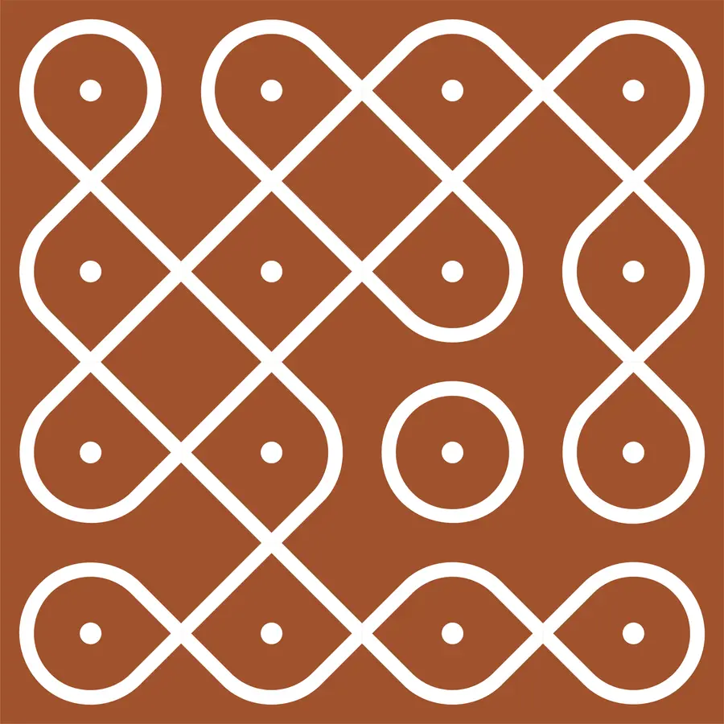
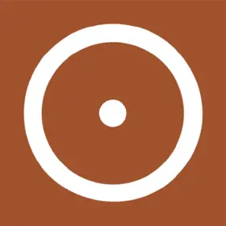
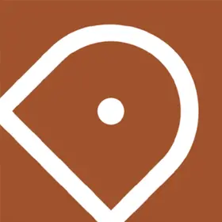
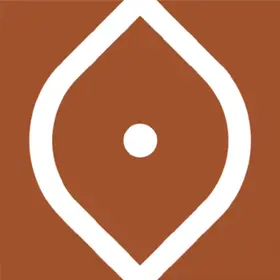
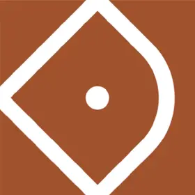
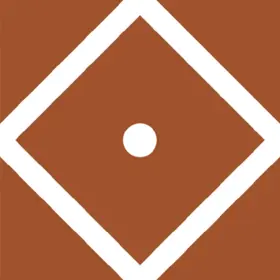
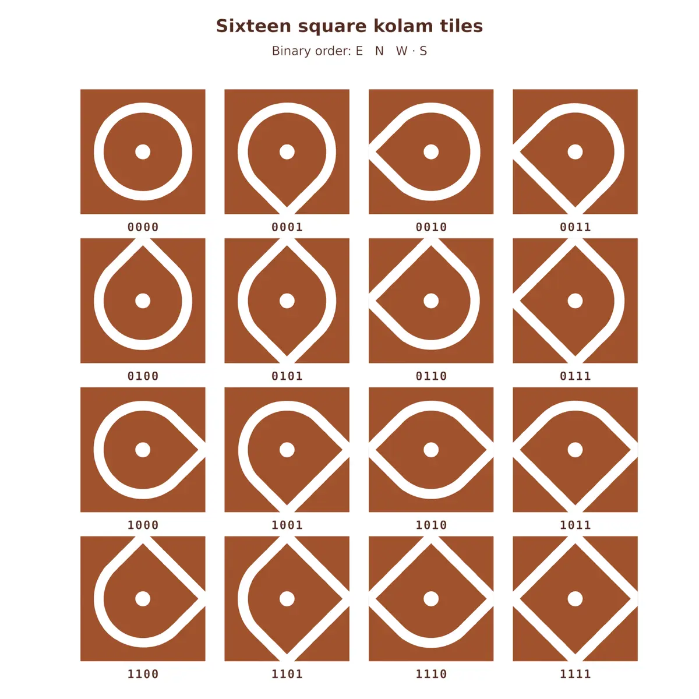
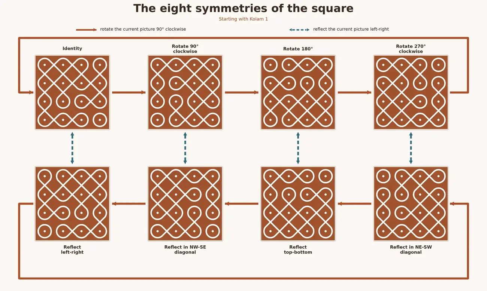
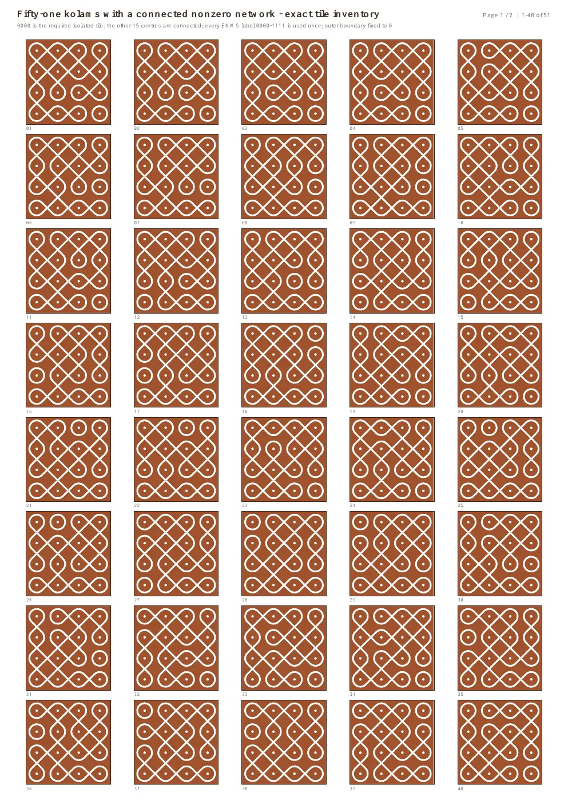

```{=html}
<script type="application/ld+json">
{
  "@context": "https://schema.org",
  "@type": "Article",
  "headline": "From Sixteen Tiles to Fifty-One Kolams",
  "description": "How a puzzle based on kolam tiles meets graph theory, Boolean satisfiability, and the mathematics of symmetry.",
  "author": { "@type": "Person", "name": "Mohan Rajendran" },
  "datePublished": "2026-07-17T14:45:00+05:30",
  "dateModified": "2026-07-17T18:40:00+05:30",
  "image": "https://mathnomad.in/writing/articles/binary-kolam-tiles/kolam-13-hero.webp",
  "articleSection": ["Everyone", "Exposition"],
  "keywords": ["Pulli kolam", "Sikku kolam", "Kolam tiles", "Graph theory", "Boolean satisfiability", "Combinatorial enumeration", "Dihedral symmetry", "Burnside's lemma"],
  "mainEntityOfPage": "https://mathnomad.in/writing/articles/binary-kolam-tiles/"
}
</script>
```

::: {.hero aria-labelledby="article-title"}
```{=html}
<div class="hero-wash hero-wash-one" aria-hidden="true"></div>
<div class="hero-wash hero-wash-two" aria-hidden="true"></div>
<div class="hero-inner">
  <div class="eyebrow">
    <span>Writing</span><span aria-hidden="true">·</span><span>Everyone</span><span aria-hidden="true">·</span><span>Exposition</span>
  </div>
  <h1 id="article-title">
    <span>From Sixteen</span>
    <span>Tiles to</span>
    <span><em>Fifty-One Kolams</em></span>
  </h1>
  <p class="standfirst">How a puzzle based on kolam tiles meets graph theory, Boolean satisfiability, and the mathematics of symmetry.</p>
  <div class="article-meta">
    <span class="avatar" aria-hidden="true">MR</span>
    <span><strong>Mohan Rajendran</strong><small>17 July 2026</small></span>
  </div>
</div>
<div class="hero-grid">
  
</div>
```
:::

```{=html}
<details class="mobile-toc">
  <summary>On this page</summary>
  <a class="toc-context-link toc-prelude" href="#threshold"><span>Prelude</span>Kolam at the threshold</a>
  <ol>
    <li><a href="#six-to-sixteen">From six shapes to sixteen tiles</a></li>
    <li><a href="#play">Try the puzzle</a></li>
    <li><a href="#bits">A precise model of the board</a></li>
    <li><a href="#sat">A satisfiability problem</a></li>
    <li><a href="#symmetry">What does “the same” mean?</a></li>
    <li><a href="#burnside">Why the answer is 51</a></li>
  </ol>
  <a class="toc-context-link toc-appendix" href="#appendix"><span>Appendix</span>Catalogue and reproducibility status</a>
</details>
```

:::::: {.article-layout}

```{=html}
<aside class="toc" aria-label="On this page">
<p>On this page</p>
<a class="toc-context-link toc-prelude" href="#threshold"><span>Prelude</span>Kolam at the threshold</a>
<ol>
  <li><a href="#six-to-sixteen">From six shapes to sixteen tiles</a></li>
  <li><a href="#play">Try the puzzle</a></li>
  <li><a href="#bits">A precise model of the board</a></li>
  <li><a href="#sat">A satisfiability problem</a></li>
  <li><a href="#symmetry">What does “the same” mean?</a></li>
  <li><a href="#burnside">Why the answer is 51</a></li>
</ol>
<a class="toc-context-link toc-appendix" href="#appendix"><span>Appendix</span>Catalogue and reproducibility status</a>
</aside>
<article class="article-body mn-kolam-article">
```

:::: {#threshold .article-section}
<p class="section-number">Prelude</p>

## Kolam at the threshold

At daybreak, many thresholds in Tamil Nadu become temporary drawing surfaces. The ground is swept, sometimes dampened, and a *kōlam* is drawn with rice flour, rice paste, or mineral powder. Historically practised and transmitted largely by women, kōlam belongs to the meeting place between home and street: it may be a gesture of welcome, a sign of auspiciousness, a daily discipline, and a work of art intended to disappear beneath footsteps, wind, rain, and time before being made anew. <a class="cultural-sources-cue" href="#note-culture">Cultural sources <span aria-hidden="true">↓</span></a>

*Pulli* means “dot”. In a pulli kōlam, a grid of dots provides the scaffold from which lines are joined or woven. In the *sikku* or *chikku* variety, one or more closed strands loop around the dots, producing patterns that invite questions about symmetry, continuity, topology, algorithms, and counting.

<aside class="margin-quote">
  <span><b lang="ta">கோலம்</b><small>kōlam</small></span>
  <p>A temporary drawing can carry a durable idea: local choices accumulating into global form.</p>
</aside>

Mathematics is only one way of seeing kōlam. The practice also carries aesthetic, social, ritual, ecological, and personal meanings. We will study one deliberately simplified square-tile model of a sikku kōlam, not a classification of the living tradition. The model keeps a small local grammar visible, turns every rule into an exact condition, and leads to a surprising count.
::::

:::: {#six-to-sixteen .article-section}
<p class="section-number">01</p>

## From six shapes to sixteen tiles

Take a square tile and mark its centre with a dot. Draw curve segments that surround the dot and meet the midpoint of any chosen subset of the four sides; if no side is chosen, draw a closed loop inside the tile. Up to rotation, this gives six shapes. Once orientation is fixed, they yield sixteen distinct tiles.

<div class="shape-count" aria-label="Six kolam shapes and their orientation counts">
  <div><strong>1 tile</strong></div>
  <div><strong>4 tiles</strong></div>
  <div><strong>4 tiles</strong></div>
  <div><strong>2 tiles</strong></div>
  <div><strong>4 tiles</strong></div>
  <div><strong>1 tile</strong></div>
</div>

::: {.math-block role="math" aria-label="One plus four plus four plus two plus four plus one equals sixteen oriented tiles"}
<span>1 + 4 + 4 + 2 + 4 + 1</span><b>=</b><strong>16 oriented tiles</strong>
:::

To turn the pictures into mathematical objects, record only one piece of information about each side: does the curve meet the midpoint of that side? Read the sides in the fixed order **east, north, west, south**, writing 1 for “yes” and 0 for “no”. Each tile therefore receives a binary string of length four. For example, `1011` has exits to the east, west, and south, but not to the north. The label `0000` is not an empty tile: its curve closes inside the square and meets no side.

<figure class="tile-catalogue">
  
  <figcaption>The sixteen square kolam tiles, labelled from <code>0000</code> to <code>1111</code> in east–north–west–south order.</figcaption>
</figure>

<div class="challenge-card">
  <span class="challenge-label">The challenge</span>
  <h3>Can all sixteen tiles make one kolam on a 4 × 4 board?</h3>
  <p>Use every tile exactly once. Curves must agree across shared sides and may not run out through the outer boundary.</p>
  <p>The tile <code>0000</code> can never connect to a neighbouring cell, so a one-component board is impossible. We ask instead that it form the one compulsory isolated component and that the other fifteen tiles form a single connected component.</p>
</div>
::::

:::: {#play .article-section .wide-section}
<p class="section-number">02</p>

## Try the puzzle before reading on

Drag the sixteen tiles into the $4\times4$ frame in the **Square Kolam Tile Challenge**. The labels are fixed: you may move a tile, but you may not rotate it. Try to make every neighbouring pair agree and keep the fifteen nonzero tiles in one network.

```{=html}
<div class="sandbox-shell mn-sandbox-frame">
  <div class="sandbox-bar mn-sandbox-bar">
    <div class="window-dots" aria-hidden="true"><span></span><span></span><span></span></div>
    <span class="sandbox-address">lab.mathnomad.in · Square Kolam Tile Challenge</span>
    <a href="https://lab.mathnomad.in/square-kolam-tile-challenge/" target="_blank" rel="noreferrer">Open full screen <span aria-hidden="true">↗</span></a>
  </div>
  <div class="sandbox-stage">
    <div class="sandbox-loading mn-sandbox-loading" role="status"><span class="loading-tile">1010</span><span>Preparing the tile table…</span></div>
    <iframe class="mn-sandbox-iframe" data-src="https://lab.mathnomad.in/embed/square-kolam-tile-challenge/" title="Interactive Square Kolam Tile Challenge" loading="lazy" allowfullscreen></iframe>
    <div class="sandbox-mobile-poster sandbox-mobile-preview">
      
      <a class="sandbox-mobile-button" href="https://lab.mathnomad.in/square-kolam-tile-challenge/" target="_blank" rel="noreferrer">Open the interactive <span aria-hidden="true">↗</span></a>
      <p>The puzzle opens full screen so dragging tiles never competes with page scrolling.</p>
    </div>
  </div>
  <p class="sandbox-help">If the embedded puzzle does not load in your browser, use <strong>“Open full screen”</strong> above.</p>
</div>
```

<details class="hint-box">
  <summary>Hint 1: read the frame as a string of zeros</summary>
  <p>Every north bit in the top row, south bit in the bottom row, west bit in the left column, and east bit in the right column must be 0. Cross out every position at which one of a tile’s 1s would point out of the square.</p>
</details>

<details class="hint-box">
  <summary>Hint 2: use the most constrained positions</summary>
  <p>A corner has two outward-facing sides. At the top-left corner, both the north and west bits must be 0, so only <code>0000</code>, <code>0001</code>, <code>1000</code>, and <code>1001</code> can occur there. Conversely, <code>1111</code> cannot lie on the boundary and must occupy one of the four central cells.</p>
</details>

<details class="hint-box">
  <summary>Hint 3: build a compatible frontier</summary>
  <p>Once one row is placed, its four south bits must be exactly the four north bits of the next row. Build row by row, while tracing paths from <code>1111</code>: a nonzero loop cut off from the unfinished board can never be repaired later.</p>
</details>
::::

:::: {#bits .article-section}
<p class="section-number">03</p>

## A precise model of the board

We now give names to the board, the tile inventory, and the act of placing a tile. Let

::: {.math-block role="math" aria-label="V is the set of pairs x y where each coordinate is zero, one, two, or three"}
$$
V=\{(x,y):x,y\in\{0,1,2,3\}\}.
$$
:::

be the sixteen cells, with $x$ increasing eastwards and $y$ increasing southwards. Let $T=\{0,1\}^4$ be the set of sixteen ENWS words. For $t\in T$, write $t_E,t_N,t_W,t_S$ for its four bits. A placement is a function

::: {.math-block role="math" aria-label="f is a function from the cells V to the tile set T"}
$$
f:V\longrightarrow T,
$$
:::

where $f(x,y)$ is the globally oriented tile placed in cell $(x,y)$.

A successful board satisfies five precise conditions.

::: {.definition-list}
1. **Exact inventory.** The map $f$ is a bijection: every cell receives one tile and every word in $T$ occurs exactly once.
2. **Horizontal matching.** For $0\leq x<3$ and $0\leq y\leq3$,
   $$
   f(x,y)_E=f(x+1,y)_W.
   $$
3. **Vertical matching.** For $0\leq x\leq3$ and $0\leq y<3$,
   $$
   f(x,y)_S=f(x,y+1)_N.
   $$
4. **Closed outer boundary.** For every $x$ and $y$,
   $$
   f(x,0)_N=f(x,3)_S=f(0,y)_W=f(3,y)_E=0.
   $$
5. **Connectivity.** Form a graph $\Gamma_f$ whose vertices are the sixteen cells, joining neighbours when their common matched bits are both 1. If $z_0=f^{-1}(0000)$, then the subgraph on $V\setminus\{z_0\}$ must be connected.
:::

Conditions 1–4 define a *locally valid exact-inventory board*. The fifth says that $\Gamma_f$ has exactly two components: the compulsory `0000` component and one component containing all fifteen nonzero tiles.

### A small invariant with a large consequence {.subheading}

In each of the four bit positions, exactly eight of the sixteen words contain a 1. The complete inventory therefore has 32 exits. Because every exit is paired with exactly one neighbour, every locally valid board has precisely 16 active connections.

<div class="invariant-strip" aria-label="From curve exits to the cycle count">
  <div><strong>32</strong><span>curve exits</span></div>
  <i aria-hidden="true">÷ 2</i>
  <div><strong>16</strong><span>graph edges</span></div>
  <i aria-hidden="true">on</i>
  <div><strong>15</strong><span>connected vertices</span></div>
  <i aria-hidden="true">⇒</i>
  <div><strong>2</strong><span>independent cycles</span></div>
</div>

After discarding the isolated `0000` vertex, every successful answer is a connected graph with 15 vertices and 16 edges. Its cyclomatic number is therefore $16-15+1=2$.
::::

:::: {#sat .article-section}
<p class="section-number">04</p>

## From a puzzle to satisfiability

A completely unrestricted placement has $16!=20{,}922{,}789{,}888{,}000$ possibilities. Every condition can be encoded using Boolean variables, while the local rules give us an efficient way to prune the search. For each cell $v$ and tile $t$, introduce a variable

::: {.math-block role="math" aria-label="X sub v comma t equals one if and only if tile t occupies cell v"}
$$
X_{v,t}=1\quad\Longleftrightarrow\quad\text{tile }t\text{ occupies cell }v.
$$
:::

There are $16\times16=256$ such variables. The puzzle is now a Boolean satisfiability problem, usually abbreviated to **SAT**. Bijection gives the “one tile per cell” and “one cell per tile” clauses; matching and boundary conditions forbid incompatible placements. Connectivity is global, so it can be checked afterwards by graph search or encoded with auxiliary reachability variables.

::: {.constraint-list}
1. **One tile in every cell.** Exactly one of the sixteen statements $X_{v,t}$ is true for each cell $v$.
2. **Every tile used once.** For each label $t$, exactly one cell variable is true.
3. **Only compatible neighbours.** Any pair of labels whose facing bits disagree is forbidden.
4. **No open boundary.** A tile with an outward-facing 1 is forbidden in that position.
5. **Reach all fifteen tiles.** A breadth-first search from the unique `1111` tile must visit every nonzero tile.
:::

A general SAT solver can enumerate the answers. For this $4\times4$ square, a row-by-row search makes the three reported counts particularly transparent.

### 1,448 horizontally legal rows {.subheading}

Call $R=(t_0,t_1,t_2,t_3)$ a horizontally legal row when its four labels are distinct, its left and right outer bits are 0, and each pair of facing east–west bits agrees. Testing the $16\cdot15\cdot14\cdot13=43{,}680$ ordered four-tuples gives exactly **1,448** such rows.

There is also a compact count. Record the five horizontal boundary and interface bits. The two outer bits are fixed at 0, while the three inner bits are free, giving eight paths from 0 back to 0. For each transition, the north and south bits are free; correcting for repeated transitions so that labels remain distinct gives

$$
24+3\cdot192+2\cdot256+144+192=1{,}448.
$$

### 652 locally valid boards {.subheading}

For each legal row, retain its four north bits, four south bits, and a sixteen-bit mask recording the labels it uses. Stack four rows only when adjacent north–south signatures match, the top and bottom boundary signatures are `0000`, and the four masks are disjoint and together contain all sixteen labels. Exactly **652** boards pass those local matching, boundary, and inventory tests. The search is exhaustive because every board has one unique ordered decomposition into four rows.

### 408 connected nonzero networks {.subheading}

Finally, construct $\Gamma_f$ for each of the 652 boards and run a breadth-first search from `1111`. Exactly **408** searches reach all fifteen nonzero vertices. The other 244 boards obey every local rule but split the nonzero tiles into two or more components.

<div class="search-pipeline" aria-label="Exhaustive search counts">
  <div><strong>1,448</strong><span>horizontally legal rows</span></div>
  <b aria-hidden="true">→</b>
  <div><strong>652</strong><span>locally valid boards</span></div>
  <b aria-hidden="true">→</b>
  <div><strong>408</strong><span>accepted boards</span></div>
</div>

```{=html}
<div class="enumeration-examples" aria-label="Three stages of the exhaustive enumeration">
  <figure>
    <span class="example-kicker">Among the 1,448 rows</span>
    <svg viewBox="66 172 360 118" width="360" height="118" role="img" aria-labelledby="enum-row-title enum-row-desc" style="display:block;width:100%;height:auto">
      <title id="enum-row-title">A horizontally legal row</title>
      <desc id="enum-row-desc">A legal row whose horizontal edges match but which cannot occur in any complete locally valid board.</desc>
      <image href="enumeration-examples.svg" width="1500" height="610" aria-hidden="true"></image>
    </svg>
    <figcaption>A horizontally legal row that cannot occur in any of the 652 complete boards.</figcaption>
  </figure>
  <figure>
    <span class="example-kicker">Among the 652, but not the 408</span>
    <svg viewBox="594 130 320 320" width="320" height="320" role="img" aria-labelledby="enum-disconnected-title enum-disconnected-desc" style="display:block;width:100%;height:auto">
      <title id="enum-disconnected-title">A locally valid but disconnected board</title>
      <desc id="enum-disconnected-desc">A complete locally valid board rejected because its nonzero tiles form several connected components.</desc>
      <image href="enumeration-examples.svg" width="1500" height="610" aria-hidden="true"></image>
    </svg>
    <figcaption>A locally valid board rejected by connectivity. The colours distinguish components of sizes 9, 3, 3, and 1.</figcaption>
  </figure>
  <figure>
    <span class="example-kicker">Among the 408 accepted boards</span>
    <svg viewBox="1090 130 320 320" width="320" height="320" role="img" aria-labelledby="enum-accepted-title enum-accepted-desc" style="display:block;width:100%;height:auto">
      <title id="enum-accepted-title">An accepted connected board</title>
      <desc id="enum-accepted-desc">An accepted board in which all fifteen nonzero tiles belong to one component and only the 0000 tile is isolated.</desc>
      <image href="enumeration-examples.svg" width="1500" height="610" aria-hidden="true"></image>
    </svg>
    <figcaption>An accepted board: all fifteen nonzero tiles belong to one component, with only <code>0000</code> isolated.</figcaption>
  </figure>
</div>
```

::: {.proof-note}
<span>Computer-assisted proof</span>

The number 408 is not a sample or a heuristic estimate. The row program examines every possible locally valid row stack exactly once. A structurally independent cell-by-cell search returns the same 652 and 408 totals.
:::
::::

:::: {#symmetry .article-section}
<p class="section-number">05</p>

## When are two answers really the same?

Suppose you solve the puzzle and then turn the entire sheet through 90 degrees. The picture has changed its orientation, but not its essential arrangement. The same is true if you reflect the whole square in a mirror.

A square has eight rigid symmetries. Together they form the dihedral group $D_4$: four rotations and four reflections.

<figure class="symmetry-figure">
  
  <figcaption>Kolam 1 under the identity, three rotations, and four reflections. Solid arrows rotate the current picture through 90 degrees clockwise; dotted arrows reflect it left–right.</figcaption>
</figure>

<div class="important-note">
  <strong>One distinction matters.</strong>
  <p>We do not rotate a single tile while placing it. A symmetry moves the completed board as a whole, carrying every compass direction with it. Under a quarter-turn, for example, an east exit becomes a south exit everywhere at once.</p>
</div>

The eight images of one board form its *orbit*. Counting “up to symmetry” means counting these orbits rather than individual labelled boards. But can we simply divide 408 by 8? Only if every orbit really has eight members. A highly symmetric board might have fewer, so we need a theorem that handles this possibility correctly.
::::

:::: {#burnside .article-section}
<p class="section-number">06</p>

## Burnside’s lemma and the number 51

Let $X$ be the set of 408 accepted labelled boards. The eight symmetries of the square act on $X$ by moving a whole completed board. An orbit is the collection of boards obtainable from one another in this way, and our goal is to count these orbits.

Why not immediately divide 408 by 8? A board with its own symmetry could return to itself under more than the identity, making its orbit smaller than eight. [Burnside’s lemma](../../topics/burnside-lemma/index.qmd) corrects for exactly this possibility. For a symmetry $g$, let $\operatorname{Fix}(g)$ be the accepted boards that $g$ leaves unchanged. Then

::: {.math-block role="math" aria-label="The number of symmetry classes is one eighth of the sum of the fixed board counts"}
$$
\#(X/D_4)=\frac{1}{8}\sum_{g\in D_4}|\operatorname{Fix}(g)|.
$$
:::

The average comes from a double count. Count pairs $(B,g)$ for which $g$ fixes $B$. Counting first by symmetry gives the sum above. If a board is fixed by $s$ symmetries, its orbit contains $8/s$ boards, and each is fixed by $s$ symmetries. Thus every orbit contributes $(8/s)s=8$ pairs. Dividing the total by eight counts the orbits.

In our puzzle, the identity fixes all 408 boards. Both `0000` and `1111` are unchanged by every permutation of the compass directions. A symmetric board must therefore place both labels in cells fixed by the spatial symmetry. On an even $4\times4$ grid, a nontrivial rotation or a horizontal or vertical reflection has no fixed cell, so none can fix an accepted board.

A diagonal reflection does have four fixed cells, so it needs a final finite check. Each diagonal fixes two locally valid boards, but their component sizes are 9, 3, 3, and 1. None satisfies our connectivity rule.

::: {.table-wrap tabindex="0" role="region" aria-label="Burnside fixed-board counts; scroll horizontally to see every column"}
<p class="table-scroll-cue" aria-hidden="true">Swipe to see all columns <span>→</span></p>

| Symmetry type | How many | Connected boards fixed | Comment |
|---|:---:|:---:|---|
| Identity | 1 | **408** | Every board |
| Quarter-turns | 2 | **0 each** | 90° and 270° |
| Half-turn | 1 | **0** | 180° |
| Axis reflections | 2 | **0 each** | Horizontal and vertical |
| Diagonal reflections | 2 | **0 each** | Fixed candidates are disconnected |
:::

<div class="burnside-result">
  <p>Burnside’s average</p>
  <div><span>408 + 0 + 0 + 0 + 0 + 0 + 0 + 0</span><i aria-hidden="true">÷</i><span>8</span><b>=</b><strong>51</strong></div>
  <h3>There are exactly 51 kolams up to the symmetries of the square.</h3>
  <p>More precisely: 51 symmetry classes of exact-inventory 4 × 4 boards satisfying the boundary, matching, and two-component conditions. Every class contains eight labelled boards.</p>
</div>
::::

:::: {#appendix .article-section .appendix-section}
<p class="section-number">Appendix</p>

## Catalogue and reproducibility status

A finite computer-assisted proof should be inspectable. The catalogue below is available now. A reproducibility companion—documenting the tile convention, enumeration, connectivity test, symmetry action, and an independent Burnside ledger—is in preparation. When ready, it will be published alongside this article.

```{=html}
<div class="resource-grid">
  <div class="resource-card resource-card-static draft-link">
    <span class="resource-type">Code · In preparation</span>
    <h3>Reproducibility companion</h3>
    <p>The generator and Burnside ledger are not yet published. This card will link to the exact source and instructions when they are ready.</p>
    <strong>Publication status: in preparation</strong>
  </div>
  <a class="resource-card" href="fifty-one-kolams.pdf" target="_blank" rel="noreferrer">
    <span class="resource-type">Catalogue · PDF · 2 pages · 70 KB</span>
    <h3>See all 51 completed kolams</h3>
    <p>One canonical representative from every square-symmetry class, rendered from the exact enumeration.</p>
    <strong>Open the catalogue <span aria-hidden="true">↗</span></strong>
  </a>
</div>
```

<figure class="catalogue-preview">
  <a href="fifty-one-kolams.pdf" target="_blank" rel="noreferrer" aria-label="Open the two-page PDF catalogue of all 51 kolams">
    
  </a>
  <figcaption>A preview of the catalogue. Each panel stands for one <i>D</i><sub>4</sub>-orbit, so its seven rotated or reflected copies are omitted. <a href="fifty-one-kolams.pdf" target="_blank" rel="noreferrer">Open the full two-page PDF</a>.</figcaption>
</figure>

<details class="code-details">
  <summary>What does the enumeration do?</summary>
  <pre><code>build the 1,448 legal four-tile rows
index rows by their north and south signatures
join compatible rows with disjoint tile masks
keep the 652 exact-inventory boards
test reachability from the 1111 tile
keep the 408 accepted boards
replace each D₄ orbit by its least representative
verify: 51 orbits × 8 boards = 408</code></pre>
</details>
::::

:::: {.article-section .notes-section aria-labelledby="notes-heading"}
```{=html}
<h2 id="notes-heading">Notes and further reading</h2>
<ol>
  <li id="note-culture">For the threshold setting, materials, transmission, and cultural meanings of kōlam, see Sahapedia’s <a href="https://www.sahapedia.org/significance-of-kolam-tamil-culture">“Significance of Kolam in Tamil Culture”</a> and the <a href="https://ignca.gov.in/PDF_data/Martha_Strawn_collecction_Kolam.pdf">Indira Gandhi National Centre for the Arts archive note</a>.</li>
  <li>For mathematical approaches, see Marcia Ascher’s <a href="https://www.americanscientist.org/article/the-kolam-tradition">“The Kolam Tradition”</a>; Gift Siromoney, Rani Siromoney, and Kamala Krithivasan’s <a href="https://www.sciencedirect.com/science/article/pii/0146664X74900112">“Array Grammars and Kolam”</a>; and Venkatraman Gopalan’s <a href="https://www.tandfonline.com/doi/full/10.1080/17513472.2024.2423568">square-tile sikku kōlam enumeration</a>.</li>
  <li>The exact-inventory puzzle is closely related to edge-matching or Wang-tile problems: local colour matching is replaced here by equality of 0–1 side data.</li>
  <li><a href="https://mathworld.wolfram.com/BurnsidesLemma.html">Burnside’s lemma</a> is sometimes called the orbit-counting lemma. Its power is that it remains correct even when different objects have orbits of different sizes.</li>
</ol>
```
::::

:::: {.article-section .citation-section .citation-panel aria-labelledby="citation-heading"}
<p class="section-number">Citation</p>

```{=html}
<h2 id="citation-heading">Cite this article</h2>
<p id="preferred-citation" class="citation-text">Rajendran, Mohan. “From Sixteen Tiles to Fifty-One Kolams.” <i>Math Nomad</i>, 17 July 2026, <a href="https://mathnomad.in/writing/articles/binary-kolam-tiles/">https://mathnomad.in/writing/articles/binary-kolam-tiles/</a>.</p>
<pre id="bibtex-citation" hidden>@article{rajendran2026kolams,
  author = {Mohan Rajendran},
  title = {From Sixteen Tiles to Fifty-One Kolams},
  journal = {Math Nomad},
  year = {2026},
  month = {July},
  url = {https://mathnomad.in/writing/articles/binary-kolam-tiles/}
}</pre>
<div class="citation-actions" aria-label="Citation copy options">
  <button type="button" data-copy-target="#preferred-citation">Copy citation</button>
  <button type="button" data-copy-target="#bibtex-citation">Copy BibTeX</button>
  <span class="citation-feedback" role="status" aria-live="polite"></span>
</div>
```
::::

:::: {.article-section .related-section aria-labelledby="related-heading"}
<p class="section-number">Continue</p>

```{=html}
<h2 id="related-heading">Take the next route</h2>
<div class="related-routes">
  <a href="https://lab.mathnomad.in/square-kolam-tile-challenge/" target="_blank" rel="noreferrer">
    <span>Interactive</span><strong>Play the tile challenge</strong><small>Build a board in the full-screen laboratory.</small>
  </a>
  <a href="/projects/entries/kolam-tile-laboratory/">
    <span>Project</span><strong>Follow the kolam tile laboratory</strong><small>See what is being built around this investigation.</small>
  </a>
  <a href="/courses/resources/kolam-investigation/">
    <span>Classroom</span><strong>Use the investigation with learners</strong><small>Take a guided route through the puzzle and its mathematics.</small>
  </a>
  <a href="/writing/topics/burnside-lemma/">
    <span>Topic</span><strong>Explore Burnside’s lemma</strong><small>Connect this count to the orbit-counting principle.</small>
  </a>
</div>
```
::::

<div class="article-end">
  <span aria-hidden="true">❧</span>
  <p>The exhaustive enumeration certifies the count; the completed kolams remind us why the objects were worth counting.</p>
</div>

```{=html}
</article>
```

::::::

```{=html}
<script src="kolam-article.js" defer></script>
```
