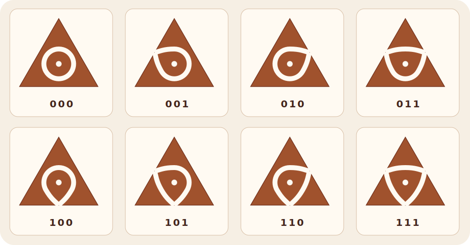

```{=html}
<script type="application/ld+json">
{
  "@context": "https://schema.org",
  "@type": "Article",
  "headline": "Kolams on Octahedron",
  "description": "How eight triangular tiles, a dual cube, and a seven-vertex tree lead to exactly three kolams—without exhaustive computation.",
  "author": { "@type": "Person", "name": "Mohan Rajendran" },
  "datePublished": "2026-07-20T23:54:10+05:30",
  "dateModified": "2026-07-20T23:54:10+05:30",
  "image": "https://mathnomad.in/writing/articles/kolams-on-an-octahedron/octahedron-hero.png",
  "articleSection": ["Everyone", "Exposition"],
  "keywords": ["Kolam", "Triangular kolam tiles", "Octahedron", "Dual cube", "Graph theory", "Euler characteristic", "Trees", "Octahedral symmetry"],
  "mainEntityOfPage": "https://mathnomad.in/writing/articles/kolams-on-an-octahedron/"
}
</script>
```

::: {.hero aria-labelledby="article-title"}
```{=html}
<div class="hero-wash hero-wash-one" aria-hidden="true"></div>
<div class="hero-wash hero-wash-two" aria-hidden="true"></div>
<div class="hero-inner">
  <div class="eyebrow">
    <span>Writing</span><span aria-hidden="true">·</span><span>Everyone</span><span aria-hidden="true">·</span><span>Exposition</span>
  </div>
  <h1 id="article-title">
    <span>Kolams on</span>
    <span><em>Octahedron</em></span>
  </h1>
  <p class="standfirst">How eight triangular tiles, a dual cube, and a seven-vertex tree lead to exactly three kolams—without exhaustive computation.</p>
  <div class="article-meta">
    <span class="avatar" aria-hidden="true">MR</span>
    <span><strong>Mohan Rajendran</strong><small>20 July 2026</small></span>
  </div>
</div>
<div class="hero-grid">
  
</div>
```
:::

```{=html}
<details class="mobile-toc">
  <summary>On this page</summary>
  <a class="toc-context-link toc-prelude" href="#from-square-to-surface"><span>Prelude</span>From a square board to a closed surface</a>
  <ol>
    <li><a href="#eight-tiles">Eight triangular tiles</a></li>
    <li><a href="#why-octahedron">Why an octahedron?</a></li>
    <li><a href="#dual-cube">The cube hidden inside</a></li>
    <li><a href="#six-edges">Twelve exits become six edges</a></li>
    <li><a href="#automatic">Two components, automatically</a></li>
    <li><a href="#three-trees">A subdivided Y</a></li>
    <li><a href="#directions">Three tree shapes are not yet three kolams</a></li>
    <li><a href="#symmetry">Symmetry and the final count</a></li>
    <li><a href="#without-search">A proof without exhaustive computation</a></li>
    <li><a href="#fold">Fold the three kolams</a></li>
  </ol>
</details>
```

:::::: {.article-layout}

```{=html}
<aside class="toc" aria-label="On this page">
<p>On this page</p>
<a class="toc-context-link toc-prelude" href="#from-square-to-surface"><span>Prelude</span>From a square board to a closed surface</a>
<ol>
  <li><a href="#eight-tiles">Eight triangular tiles</a></li>
  <li><a href="#why-octahedron">Why an octahedron?</a></li>
  <li><a href="#dual-cube">The cube hidden inside</a></li>
  <li><a href="#six-edges">Twelve exits become six edges</a></li>
  <li><a href="#automatic">Two components, automatically</a></li>
  <li><a href="#three-trees">A subdivided Y</a></li>
  <li><a href="#directions">Three tree shapes are not yet three kolams</a></li>
  <li><a href="#symmetry">Symmetry and the final count</a></li>
  <li><a href="#without-search">A proof without exhaustive computation</a></li>
  <li><a href="#fold">Fold the three kolams</a></li>
</ol>
</aside>
<article class="article-body mn-kolam-article">
```

:::: {#from-square-to-surface .article-section}
<p class="section-number">Prelude</p>

## From a square board to a closed surface

In [*From Sixteen Tiles to Fifty-One Kolams*](../binary-kolam-tiles/index.qmd), we placed sixteen square tiles inside a square boundary. Every tile carried four bits, neighbouring bits had to agree, and a computer-assisted enumeration reduced the valid boards to 51 symmetry classes.

What changes if the tiles are equilateral triangles?

A triangle has three sides, so its local information is shorter. There are only eight possible binary labels. Eight equilateral triangles are also the faces of a regular octahedron. The board can therefore close around itself: there is no outer boundary, and every side meets another tile.

We will ask for arrangements that use each of the eight tiles exactly once, match across every edge, and draw exactly two curve components: the small loop on `000`, and one connected kolam through the other seven tiles.

The surprise is not merely that the answer is three. It is that no exhaustive search is needed. Once the octahedron is replaced by its dual cube, the tile inventory forces a forest, the forest forces a subdivided $Y$, and the $Y$ has only three possible sets of arm lengths.

<div class="proof-banner">
  <strong>Proof status</strong>
  <p>The classification in this article is entirely deductive. The interactive at the end illustrates the three representatives; it is not used to establish completeness.</p>
</div>

As in the companion article, this is a deliberately simplified mathematical model inspired by *sikku* or *chikku* kōlam. It is not a classification of the living tradition, which carries artistic, social, ritual, ecological, and personal meanings beyond the model. <a class="cultural-sources-cue" href="#note-culture">Cultural sources <span aria-hidden="true">↓</span></a>
::::

:::: {#eight-tiles .article-section}
<p class="section-number">01</p>

## Eight triangular tiles

Fix three side names on an equilateral triangle. In the upward-facing drawings below, read them in the order

::: {.binary-key aria-label="The binary convention for a triangular tile"}
::: {}
**X**

base
:::
::: {}
**Y**

right side
:::
::: {}
**Z**

left side
:::
:::

Write 1 when the kolam curve meets the midpoint of that side, and 0 when it does not. Each tile receives a word $XYZ$ of length three. Thus `101` meets the $X$- and $Z$-sides but not the $Y$-side. The word `000` is not blank: its curve is a small closed loop that meets no side.

Each bit has two possible values, so the total number of globally oriented tiles is

::: {.math-block role="math" aria-label="Two cubed equals eight triangular tiles"}
$$
2^3=8.
$$
:::

<figure class="tile-catalogue triangle-catalogue">
  
  <figcaption>The eight oriented triangular tiles. A 1 records a curve meeting the corresponding side midpoint; a 0 records no meeting.</figcaption>
</figure>

The orientation is global. We may move an entire completed octahedron by a symmetry, but we do not rotate one labelled tile independently after placing it.
::::

:::: {#why-octahedron .article-section}
<p class="section-number">02</p>

## Why an octahedron?

Suppose a closed Platonic surface uses one triangular face for each tile. Then the number of faces is

$$
F=8.
$$

Every face has three edges, and every edge belongs to two faces. Counting face–edge incidences in two ways gives

$$
3F=2E,
$$

so $E=12$. Euler's formula for a polyhedral sphere now gives

$$
V-E+F=2,
$$

and hence

$$
V=2+12-8=6.
$$

There are $3F=24$ face–vertex incidences. Because a Platonic solid looks the same at every vertex, four triangles meet at each of the six vertices. The resulting type is $\{3,4\}$: triangular faces, four around each vertex. This is the regular octahedron.

<div class="invariant-strip" aria-label="Euler's formula identifies the octahedron">
  <div><strong>8</strong><span>triangular faces</span></div>
  <i aria-hidden="true">→</i>
  <div><strong>12</strong><span>edges</span></div>
  <i aria-hidden="true">→</i>
  <div><strong>6</strong><span>vertices</span></div>
  <i aria-hidden="true">→</i>
  <div><strong>4</strong><span>faces at each vertex</span></div>
</div>

The solid is therefore not an arbitrary container chosen after the tiles were made. Among the Platonic solids, the eight-face inventory points directly to the octahedron.
::::

:::: {#dual-cube .article-section}
<p class="section-number">03</p>

## The cube hidden inside the octahedron

The curves are drawn on octahedral faces, but the proof becomes simpler when we record only which faces touch.

Place one vertex at each face centre and join two centres when their faces share an edge. This is the *dual graph* of the octahedron. It is a cube: the octahedron's eight faces become the cube's eight vertices, and its twelve edges become the cube's twelve edges.

There is also an intrinsic way to name the three side directions. Group the six octahedron vertices into three opposite pairs

$$
X_+,X_-;\qquad Y_+,Y_-;\qquad Z_+,Z_-.
$$

Every triangular face contains one vertex from each pair. We label it by a sign triple, or equivalently by a word in $\{0,1\}^3$. On a face, the $X$-side is the side opposite its $X$-vertex, and similarly for $Y$ and $Z$. Crossing an $X$-side changes only the $X$-coordinate of the face label. The same is true in the other two directions.

Thus the dual graph is precisely the three-dimensional cube

$$
Q_3=\{0,1\}^3.
$$

Let $T=\{0,1\}^3$ be the set of tile words. A placement is a bijection

$$
f:Q_3\longrightarrow T.
$$

The bijection is the exact-inventory rule. Every cube vertex receives one tile, and every tile is used exactly once.

If $x\oplus e_i$ is the cube neighbour obtained by changing coordinate $i$, then matching across the shared octahedron edge means

$$
f(x)_i=f(x\oplus e_i)_i.
$$

Now retain only the *active* shared edges: include the cube edge $\{x,x\oplus e_i\}$ when the common $i$th bit is 1. Call the resulting graph $\Gamma_f$. The label of a vertex tells us exactly which active directions meet there, so

$$
\deg_{\Gamma_f}(x)=\text{number of 1s in }f(x).
$$

Each tile motif is connected within its triangular face. Consequently, two face motifs belong to the same drawn curve component exactly when their vertices belong to the same component of $\Gamma_f$. The graph keeps all the connectivity information we need.
::::

:::: {#six-edges .article-section}
<p class="section-number">04</p>

## Twelve exits become six edges

The eight binary words have a rigid weight pattern.

<div class="degree-ledger" aria-label="Tile labels grouped by their number of active sides">
  <div><code>000</code><strong>0</strong><small>active sides</small></div>
  <div><code>001, 010, 100</code><strong>1</strong><small>active side each</small></div>
  <div><code>011, 101, 110</code><strong>2</strong><small>active sides each</small></div>
  <div><code>111</code><strong>3</strong><small>active sides</small></div>
</div>

Consequently, the degree multiset of $\Gamma_f$ is

$$
0,1,1,1,2,2,2,3.
$$

There are twelve 1s in the full inventory:

$$
0+3\cdot1+3\cdot2+3=12.
$$

Each active octahedron edge is seen from both of its incident faces, so those twelve incidences pair up to give

$$
|E(\Gamma_f)|=\frac{12}{2}=6.
$$

This small count already tells us almost everything about the global kolam.
::::

:::: {#automatic .article-section}
<p class="section-number">05</p>

## Two components, automatically

We intended to require two components. In fact, matching and exact inventory force them.

First we show that $\Gamma_f$ has no cycle. A vertex on a cycle has degree at least two. Our inventory contains only four such vertices: the three weight-two tiles and `111`. Any cycle can therefore use at most four vertices.

The cube is bipartite, so it has no triangles. A cycle would have to be a four-cycle using all four vertices of degree at least two. Every four-cycle in a cube alternates between two directions, say $i$ and $j$. At each of its three degree-two vertices, the two active directions would then be exactly $\{i,j\}$.

But that would give all three vertices the same tile label. Exact inventory requires the degree-two labels to be the three different words `110`, `101`, and `011`. This contradiction shows that no cycle exists.

Therefore $\Gamma_f$ is a forest. A forest with eight vertices and six edges has

$$
8-6=2
$$

components. The tile `000` is the unique degree-zero vertex, so it is one isolated component. Every other tile must lie in the second component.

<div class="burnside-result">
  <p>The global condition that comes for free</p>
  <div><span>8 vertices</span><i aria-hidden="true">−</i><span>6 forest edges</span><b>=</b><strong>2 components</strong></div>
  <h3>Every matching exact-inventory placement already has exactly two curve components.</h3>
  <p>The isolated component is <code>000</code>; the other seven tiles form one connected tree.</p>
</div>

This is the second appearance of Euler characteristic. First, $V-E+F=2$ identified the surface. Now, for a forest, $V-E$ counts its components.
::::

:::: {#three-trees .article-section}
<p class="section-number">06</p>

## A subdivided Y

The seven-vertex component is a tree with degree sequence

$$
3,2,2,2,1,1,1.
$$

Its unique degree-three vertex is the face carrying `111`. Remove that central vertex. What remains is three paths: the three arms of a $Y$.

Let their lengths be positive integers $\ell_1,\ell_2,\ell_3$. The tree has six edges in total, so

$$
\ell_1+\ell_2+\ell_3=6,
\qquad \ell_i\geq1.
$$

Up to reordering, there are only three positive partitions of 6 into three parts.

<div class="partition-grid" aria-label="The three possible arm-length partitions">
  <div class="partition-card">
    <svg viewBox="0 0 180 92" aria-hidden="true"><g fill="none" stroke="#a0522d" stroke-width="5" stroke-linecap="round"><path d="M90 45 39 16M90 45 141 16M90 45 90 78"/></g><g fill="#fffaf2" stroke="#3f6b62" stroke-width="3"><circle cx="90" cy="45" r="7"/><circle cx="64" cy="30" r="5"/><circle cx="116" cy="30" r="5"/><circle cx="90" cy="62" r="5"/><circle cx="39" cy="16" r="5"/><circle cx="141" cy="16" r="5"/><circle cx="90" cy="78" r="5"/></g></svg>
    <strong>(2,2,2)</strong><span>three equal arms</span>
  </div>
  <div class="partition-card">
    <svg viewBox="0 0 180 92" aria-hidden="true"><g fill="none" stroke="#a0522d" stroke-width="5" stroke-linecap="round"><path d="M90 45 24 12M90 45 146 20M90 45 90 76"/></g><g fill="#fffaf2" stroke="#3f6b62" stroke-width="3"><circle cx="90" cy="45" r="7"/><circle cx="68" cy="34" r="5"/><circle cx="46" cy="23" r="5"/><circle cx="118" cy="32" r="5"/><circle cx="24" cy="12" r="5"/><circle cx="146" cy="20" r="5"/><circle cx="90" cy="76" r="5"/></g></svg>
    <strong>(3,2,1)</strong><span>three unequal arms</span>
  </div>
  <div class="partition-card">
    <svg viewBox="0 0 180 92" aria-hidden="true"><g fill="none" stroke="#a0522d" stroke-width="5" stroke-linecap="round"><path d="M90 45 12 10M90 45 146 20M90 45 90 76"/></g><g fill="#fffaf2" stroke="#3f6b62" stroke-width="3"><circle cx="90" cy="45" r="7"/><circle cx="70" cy="36" r="5"/><circle cx="50" cy="27" r="5"/><circle cx="31" cy="18" r="5"/><circle cx="118" cy="32" r="5"/><circle cx="12" cy="10" r="5"/><circle cx="146" cy="20" r="5"/><circle cx="90" cy="76" r="5"/></g></svg>
    <strong>(4,1,1)</strong><span>one long arm</span>
  </div>
</div>

We now have three possible *abstract tree shapes*. One final issue remains: could the same tree shape sit inside the cube in several essentially different ways?
::::

:::: {#directions .article-section}
<p class="section-number">07</p>

## Three tree shapes are not yet three kolams

The cube remembers not only which faces are joined, but also the directions of those joins.

Name the cube directions $1,2,3$. Starting at the `111` face, read the edge directions along each arm. Three facts are forced by the inventory:

1. The first directions of the arms are $1,2,3$, because the central tile is `111`.
2. The last directions are $1,2,3$, because the leaves are the three one-bit tiles.
3. At the three internal degree-two vertices, the direction pairs are $12$, $23$, and $31$, because the tiles are `110`, `011`, and `101`.

The three degree-two vertices are exactly the three transitions between consecutive symbols. Their distribution among the arms is forced by the arm lengths.

::: {.table-wrap .direction-table tabindex="0" role="region" aria-label="Canonical direction words for the three representatives"}

| Arm lengths | Canonical direction words | Why they are forced |
|---|---|---|
| $(2,2,2)$ | `12 | 23 | 31` | One transition lies on each arm. |
| $(3,2,1)$ | `123 | 31 | 2` | Two transitions lie on the long arm and one on the middle arm. |
| $(4,1,1)$ | `1231 | 2 | 3` | All three transitions lie on the long arm. |
:::

The bars separate the arms. Relabelling the directions applies one global permutation of $1,2,3$. Reversing the cyclic order gives a mirror image, which will be identified when reflections of the octahedron are allowed.

Thus every arm-length type has one realisation up to the full octahedral symmetry group. The directional argument is the step that turns three candidate tree shapes into three actual symmetry classes.
::::

:::: {#symmetry .article-section}
<p class="section-number">08</p>

## Symmetry and the final count

The octahedron and cube are dual, so they have the same symmetries. A full symmetry may move a chosen face to any one of eight faces. Once that face is fixed, it may permute its three side directions in any of $3!=6$ ways. Therefore the full symmetry group has

$$
8\cdot6=48
$$

elements.

On the dual cube, the group can be written

$$
C_2^3\rtimes S_3.
$$

The factor $C_2^3$ complements any chosen subset of the three cube coordinates, while $S_3$ permutes their directions.

Every symmetry preserves the multiset of arm lengths. The three types $(2,2,2)$, $(3,2,1)$, and $(4,1,1)$ therefore cannot become equivalent to one another. Conversely, the direction argument shows that every placement of a fixed type is related to its canonical representative by a face move and a direction permutation.

<div class="burnside-result">
  <p>Classification theorem</p>
  <h3>Up to all rotations and reflections of the octahedron, there are exactly three kolams.</h3>
  <div><strong>3</strong><span>symmetry classes</span></div>
  <p>The classes are distinguished by the arm lengths <code>(2,2,2)</code>, <code>(3,2,1)</code>, and <code>(4,1,1)</code>.</p>
</div>

There are 112 globally oriented matching placements before quotienting by symmetry. The three full-symmetry orbits have sizes

$$
16,\qquad48,\qquad48,
$$

which provide the check $16+48+48=112$. The balanced type has a threefold stabilising rotation; the other two have trivial stabilisers in the full group.

<div class="rotation-note">
  <p><strong>If reflections are not identified:</strong> the orientation-preserving rotation group has 24 elements, and each of the three classes splits into a mirror-related pair. Up to rotations alone, the answer is six.</p>
</div>
::::

:::: {#without-search .article-section}
<p class="section-number">09</p>

## A proof without exhaustive computation

The companion square-tile problem and the octahedral problem begin in the same way: binary edge data, exact inventory, local matching, global connectivity, and symmetry. They end by very different mathematical routes.

<div class="method-contrast">
  <article>
    <span>Square tiles</span>
    <h3>Structure plus exhaustive enumeration</h3>
    <p>Row constraints and graph tests reduce a vast search to 408 accepted boards. Burnside's lemma then gives 51 square-symmetry classes.</p>
  </article>
  <article>
    <span>Triangular tiles</span>
    <h3>Structure removes the search</h3>
    <p>The degree sequence forces a forest, the forest forces a subdivided Y, and three positive partitions complete the classification.</p>
  </article>
</div>

We may enumerate the $8!=40{,}320$ raw placements as an independent audit, but the proof never needs to inspect them. The number 112 is a consequence and a consistency check, not the source of the theorem.

This is a useful mathematical contrast. Sometimes computation certifies a finite landscape that remains too large to see all at once. Sometimes an invariant is strong enough to make the landscape collapse into a handful of inevitable forms.
::::

:::: {#fold .article-section .wide-section}
<p class="section-number">10</p>

## Fold the three kolams

The three representatives below are drawn on connected octahedron nets. Select a net, fold it continuously into the solid, rotate the completed octahedron, and optionally reveal the active graph used in the proof.

```{=html}
<div class="sandbox-shell mn-sandbox-frame">
  <div class="sandbox-bar mn-sandbox-bar">
    <div class="window-dots" aria-hidden="true"><span></span><span></span><span></span></div>
    <span class="sandbox-address">lab.mathnomad.in · Kolams on an Octahedron</span>
    <a href="https://lab.mathnomad.in/kolams-on-an-octahedron/" target="_blank" rel="noreferrer">Open full screen <span aria-hidden="true">↗</span></a>
  </div>
  <div class="sandbox-stage">
    <div class="sandbox-loading mn-sandbox-loading" role="status"><span class="loading-tile" aria-hidden="true">△</span><span>Preparing the foldable nets…</span></div>
    <iframe class="mn-sandbox-iframe" data-src="https://lab.mathnomad.in/embed/kolams-on-an-octahedron/" title="Interactive explorer for the three kolams on an octahedron" loading="lazy" allowfullscreen></iframe>
    <div class="sandbox-mobile-poster sandbox-mobile-preview">
      
      <a class="sandbox-mobile-button" href="https://lab.mathnomad.in/kolams-on-an-octahedron/" target="_blank" rel="noreferrer">Open the interactive <span aria-hidden="true">↗</span></a>
      <p>The explorer opens full screen so folding and rotating never compete with page scrolling.</p>
    </div>
  </div>
  <p class="sandbox-help">The interactive illustrates the theorem; the classification itself is proved in the sections above. If the embed does not load, use <strong>“Open full screen”</strong>.</p>
</div>
```
::::

:::: {.article-section .notes-section aria-labelledby="notes-heading"}
```{=html}
<h2 id="notes-heading">Notes and further reading</h2>
<ol>
  <li id="note-culture">For the threshold setting, materials, transmission, and cultural meanings of kōlam, see Sahapedia's <a href="https://www.sahapedia.org/significance-of-kolam-tamil-culture">“Significance of Kolam in Tamil Culture”</a> and the <a href="https://ignca.gov.in/PDF_data/Martha_Strawn_collecction_Kolam.pdf">Indira Gandhi National Centre for the Arts archive note on Martha Strawn's kōlam photographs</a>.</li>
  <li>For mathematical approaches to kōlam, see Marcia Ascher, <a href="https://www.americanscientist.org/node/1141">“The Kolam Tradition”</a>, <i>American Scientist</i> 90(1), 2002, p. 56, doi: 10.1511/2002.13.56; and Gift Siromoney, Rani Siromoney, and Kamala Krithivasan, <a href="https://doi.org/10.1016/0146-664X(74)90011-2">“Array Grammars and Kolam”</a>, <i>Computer Graphics and Image Processing</i> 3(1), 1974, pp. 63–82.</li>
  <li>For the square-tile model and its symmetry classification, see Venkatraman Gopalan, <a href="https://doi.org/10.1080/17513472.2024.2423568">“Symmetry Classification and Enumeration of Square-Tile Sikku Kolams”</a>, <i>Journal of Mathematics and the Arts</i> 18(3–4), 2024, pp. 244–257, and the companion Math Nomad article <a href="../binary-kolam-tiles/">“From Sixteen Tiles to Fifty-One Kolams”</a>.</li>
  <li>For classical background on regular polyhedra, duality, and symmetry groups, see H. S. M. Coxeter, <i>Regular Polytopes</i>, 3rd ed., Dover, 1973. The cube–octahedron duality identifies the two solids' symmetry groups; the full octahedral group has order 48.</li>
  <li>The cube graph used here is the three-dimensional hypercube $Q_3$. The active subgraph is not an extra approximation: under the stated connected-tile convention, its connected components agree with the components of the drawn kolam.</li>
</ol>
```
::::

:::: {.article-section .citation-section .citation-panel aria-labelledby="citation-heading"}
<p class="section-number">Citation</p>

```{=html}
<h2 id="citation-heading">Cite this article</h2>
<p id="preferred-citation" class="citation-text">Rajendran, Mohan. “Kolams on Octahedron.” <i>Math Nomad</i>, 20 July 2026, <a href="https://mathnomad.in/writing/articles/kolams-on-an-octahedron/">https://mathnomad.in/writing/articles/kolams-on-an-octahedron/</a>.</p>
<pre id="bibtex-citation" hidden>@article{rajendran2026octahedronkolams,
  author = {Mohan Rajendran},
  title = {Kolams on Octahedron},
  journal = {Math Nomad},
  year = {2026},
  month = {July},
  url = {https://mathnomad.in/writing/articles/kolams-on-an-octahedron/}
}</pre>
<pre id="ris-citation" hidden>TY  - ELEC
AU  - Rajendran, Mohan
TI  - Kolams on Octahedron
T2  - Math Nomad
PY  - 2026/07/20
UR  - https://mathnomad.in/writing/articles/kolams-on-an-octahedron/
ER  -</pre>
<div class="citation-actions" aria-label="Citation copy options">
  <button type="button" data-copy-target="#preferred-citation">Copy citation</button>
  <button type="button" data-copy-target="#bibtex-citation">Copy BibTeX</button>
  <button type="button" data-copy-target="#ris-citation">Copy RIS</button>
  <span class="citation-feedback" role="status" aria-live="polite"></span>
</div>
```
::::

:::: {.article-section .related-section aria-labelledby="related-heading"}
<p class="section-number">Continue</p>

```{=html}
<h2 id="related-heading">Take the next route</h2>
<div class="related-routes">
  <a href="../binary-kolam-tiles/">
    <span>Companion article</span><strong>From Sixteen Tiles to Fifty-One Kolams</strong><small>See how exhaustive computation solves the square-tile problem.</small>
  </a>
  <a href="https://lab.mathnomad.in/kolams-on-an-octahedron/" target="_blank" rel="noreferrer">
    <span>Interactive</span><strong>Fold the three representatives</strong><small>Explore the connected nets and completed octahedra.</small>
  </a>
  <a href="/projects/entries/kolam-tile-laboratory/">
    <span>Project</span><strong>Follow Kolam Tiles</strong><small>Find the square and triangular investigations in one place.</small>
  </a>
  <a href="/courses/resources/kolam-investigation/">
    <span>Classroom</span><strong>Use the square-tile investigation</strong><small>Take a guided route through local rules and global connectivity.</small>
  </a>
</div>
```
::::

<div class="article-end">
  <span aria-hidden="true">❧</span>
  <p>The tiles close around the octahedron; the graph opens the proof.</p>
</div>

```{=html}
</article>
```

::::::

```{=html}
<script src="octahedron-article.js" defer></script>
```
